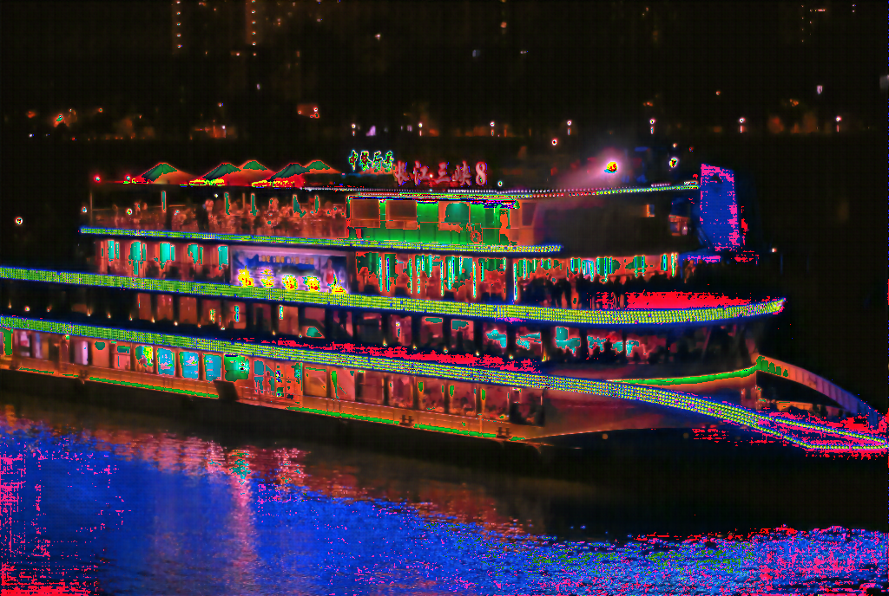

## Introduction

low_light_enhance_method 是一个记录了近几年来优秀的低光增强算法的可以即插即用的仓库。

目前实现的算法

|    | 算法名称                                                                                                                                                                                                                                                          |
|----|---------------------------------------------------------------------------------------------------------------------------------------------------------------------------------------------------------------------------------------------------------------|
| 2022 | URetinex_Net: [ URetinex-Net: Retinex-Based Deep Unfolding Network for Low-Light Image Enhancement](https://openaccess.thecvf.com/content/CVPR2022/papers/Wu_URetinex-Net_Retinex-Based_Deep_Unfolding_Network_for_Low-Light_Image_Enhancement_CVPR_2022_paper.pdf) |
| 2022 | SCI: [Toward Fast, Flexible, and Robust Low-Light Image Enhancement](https://openaccess.thecvf.com/content/CVPR2022/papers/Ma_Toward_Fast_Flexible_and_Robust_Low-Light_Image_Enhancement_CVPR_2022_paper.pdf)                                                |
| 2022 | SNR_LLIE_Net: [SNR-aware Low-Light Image Enhancement](https://jiaya.me/papers/cvpr22_xiaogang.pdf)                                                                                                                                                            |
| 2020 | SIM_CycleGAN: [Lane Detection in Low-light Conditions Using an Efficient Data Enhancement : Light Conditions Style Transfer](https://arxiv.org/abs/2002.01177)(没有预训练权重)                                                                                       |

真实低光图片上的增强效果

|     | 增强前 | 增强后 |
|-----|-----|-----|
|  URetinex-Net   |     |    |
| SCI    |     |     |
|    SNR_LLIE_Net    |                              |                                    |

### Getting Started

```
conda create -n low_light_enhance python=3.8
conda activate low_light_enhance
conda install pytorch==1.11.0 torchvision==0.12.0 torchaudio==0.11.0 cudatoolkit=11.3 -c pytorch
pip install opencv-python==4.6.0
```


