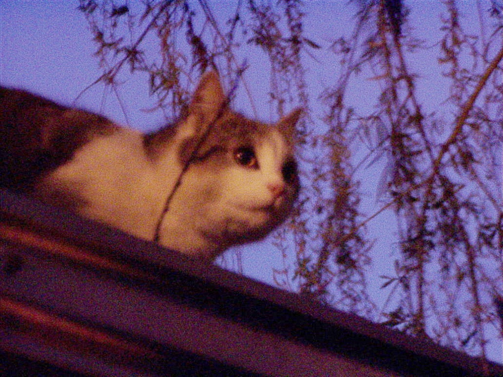
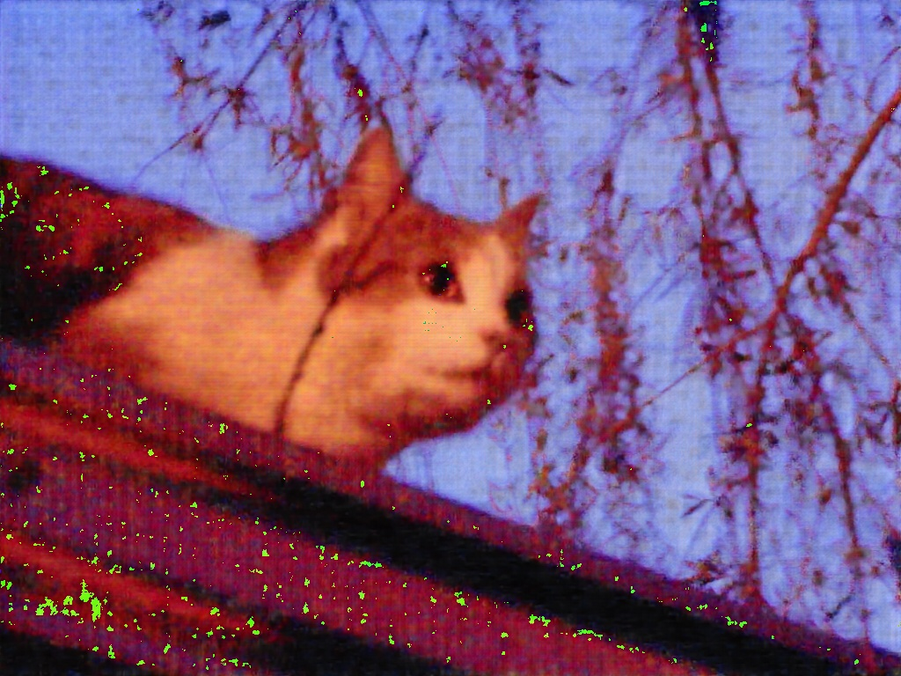
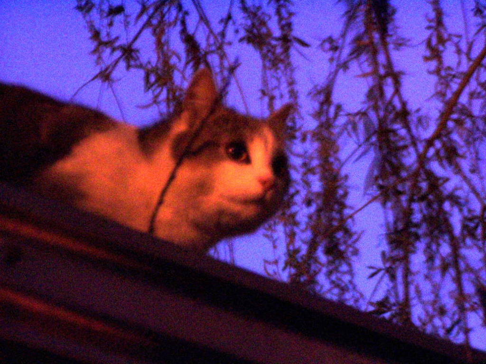
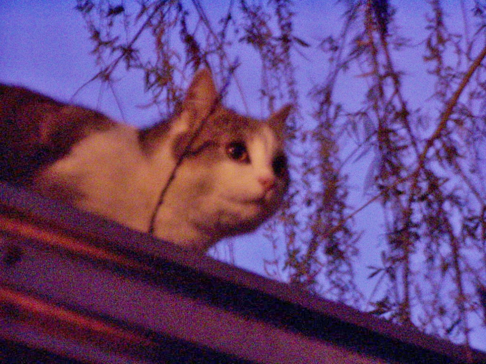
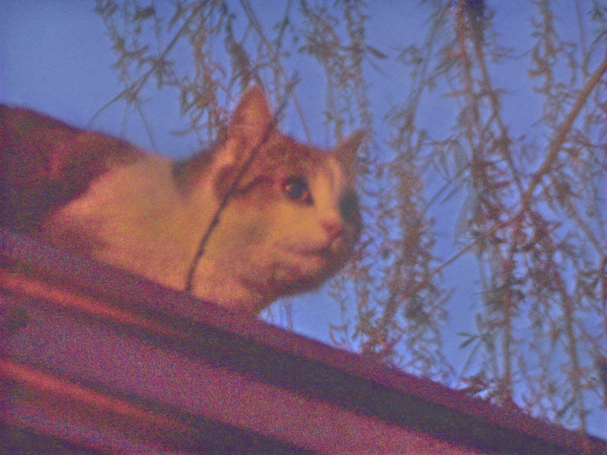

## Introduction

low_light_enhance_method 是一个记录了近几年来优秀的低光增强算法的可以即插即用的仓库。

目前实现的算法

|      | 算法名称                                                                                                                                                                    |
|------|-------------------------------------------------------------------------------------------------------------------------------------------------------------------------|
| 2022 | URetinex_Net: [ URetinex-Net: Retinex-Based Deep Unfolding Network for Low-Light Image Enhancement](model/uretinex_net/README.md)                                       |
| 2022 | SCI: [Toward Fast, Flexible, and Robust Low-Light Image Enhancement](model/self_calibrated_illumination/README.md)                                                      |
| 2022 | SNR_LLIE_Net: [SNR-aware Low-Light Image Enhancement](model/SNR_LLIE_Net/README.md)                                                                                     |
| 2020 | SIM_CycleGAN: [Lane Detection in Low-light Conditions Using an Efficient Data Enhancement : Light Conditions Style Transfer](https://arxiv.org/abs/2002.01177)(没有预训练权重) |
| 2021 | RUAS: [Retinex-inspired unrolling with cooperative prior architecture search for low-light image enhancement](model/RUAS/README.md)                                     |
| 2021 | Zero-DCE++: [	Learning to enhance low-light image via zero-reference deep curve estimation](model/zero_dce_plus/README.md)                                              |
| 2021 | EnlightenGAN: [EnlightenGAN: Deep light enhancement without paired supervision](model/EnlightenGAN/README.md)                                                                                                                                                       |

### Getting Started

```
conda create -n low_light_enhance python=3.8
conda activate low_light_enhance
conda install pytorch==1.11.0 torchvision==0.12.0 torchaudio==0.11.0 cudatoolkit=11.3 -c pytorch
pip install opencv-python==4.6.0
```


### 真实低光图片上的增强效果

|     | 增强前 | 增强后                                    |
|-----|-----|----------------------------------------|
|URetinex-Net |     |  |
|SCI    |     |          |
|SNR_LLIE_Net |  |  |
|RUAS   |  |           |
|Zero-DCE++|   |           |
|EnlightenGAN  |   | |


