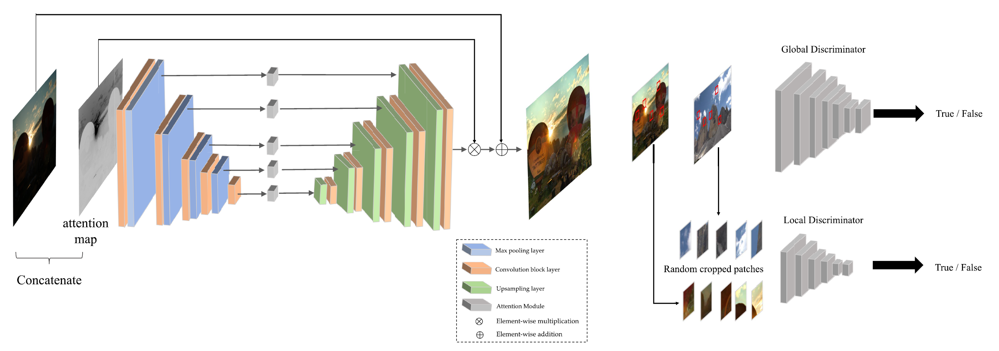
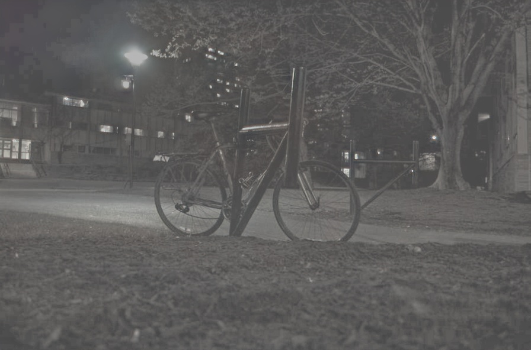
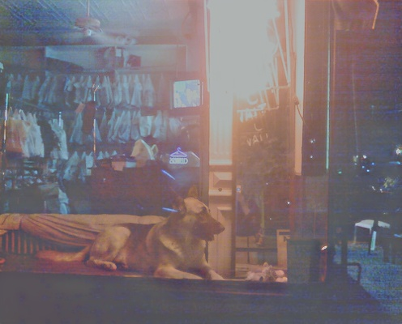

### Introduce
Paper: https://ieeexplore.ieee.org/abstract/document/9334429/

Code: https://github.com/VITA-Group/EnlightenGAN

文章设计了一个自正则注意力引导的U-Net网络。在该网络中，由对输入的RGB图像取光照通道I标准化后作为attention map，与U-Net上采样部分 (decoder) 所有特征图以及输出图像相乘做正则化无监督学习。
 
<div class="half" style="text-align: center;">
   
</div>

### Get Start
EnlightenGAN.pth: 链接：[baidu](https://pan.baidu.com/s/16I-Gj3QWu9sTay_2Dvb4rg?pwd=k5tg ), 提取码：k5tg

下载EnlightenGAN.pth, 放置到model/EnlightenGAN/目录中
```
.─EnlightenGAN
      │  __init__.py
      │  enlightengan.py
      │  README.md
      │  predict.py 
      └─ EnlightenGAN.pth
  ```

### 运行方法：复制以下代码到main.py即可运行
```angular2html
from model import EnlightenGAN
import cv2
import os

img = cv2.imread('demo/inputs/cat.jpg)
im_shape = (img.shape[1]//16*16, img.shape[0]//16*16)
img = cv2.resize(img, im_shape)
model = EnlightenGAN()
out = model(img)
cv2.imwrite('tmp.jpg',out)
```

### 结果对比
 <div class="half" style="text-align: center;">
    
</div>
 <div class="half" style="text-align: center;">
    
</div>
 <div class="half" style="text-align: center;">
    
</div>


