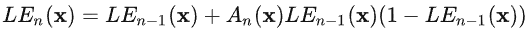
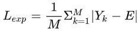
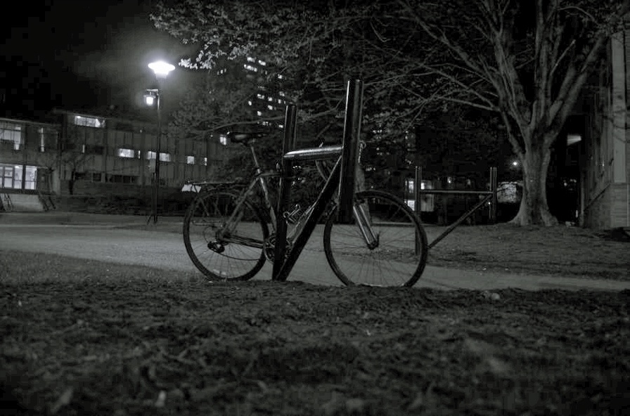
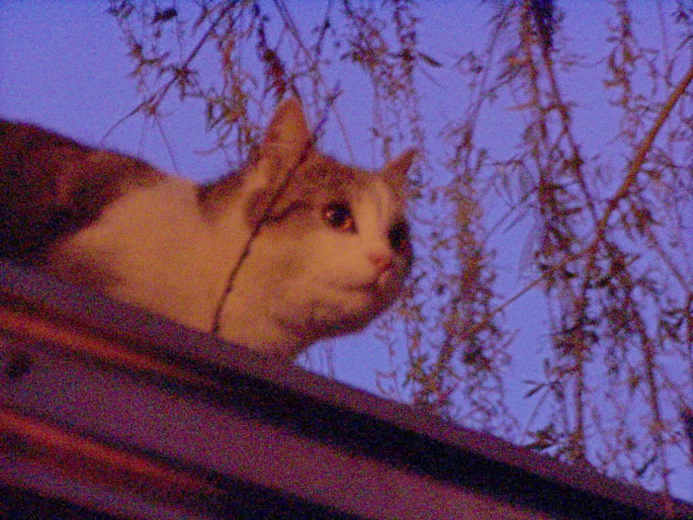

### Introduce
Paper: [Zero-DCE](https://openaccess.thecvf.com/content_CVPR_2020/html/Guo_Zero-Reference_Deep_Curve_Estimation_for_Low-Light_Image_Enhancement_CVPR_2020_paper.html)

Code: https://github.com/Li-Chongyi/Zero-DCE

个人认为Zero-DCE最重要的两条公式:
<ul>

    

   

</ul>

公式1使用curve曲线增强图片的亮度；

公式2是作为训练过程中的损失之一，M是不重叠的局部区域的数量，Y是增强图像中局部区域的平均强度值(可以简单的理解为亮度)，E为预期“亮度”的平均值，即需要网络最终输出的图片的亮度的期望值为E。

### 结果对比
 

    

 

    

 

    

