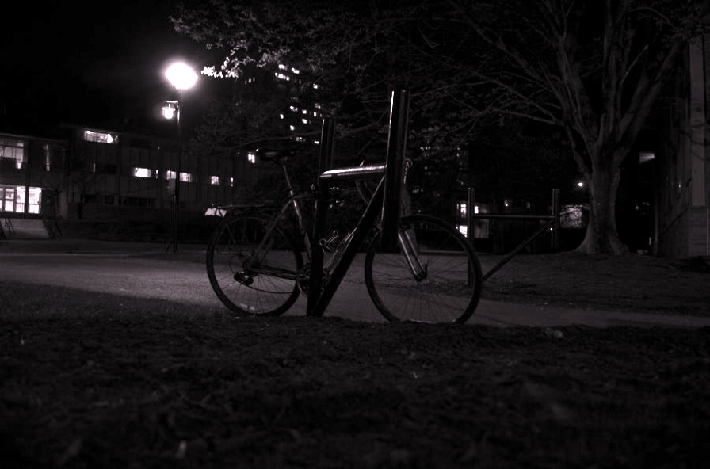

### 运行方法：复制以下代码到main.py即可运行
```angular2html
from model import RUAS
import cv2
import os

img = cv2.imread('demo/inputs/img1.png')
im_shape = (img.shape[1]//16*16, img.shape[0]//16*16)
img = cv2.resize(img, im_shape)
model = RUAS()
out = model(img)
cv2.imwrite('tmp.jpg',out)
```

### 结果对比
 <div class="half" style="text-align: center;">
    
</div>
 <div class="half" style="text-align: center;">
    
</div>
 <div class="half" style="text-align: center;">
    
</div>


