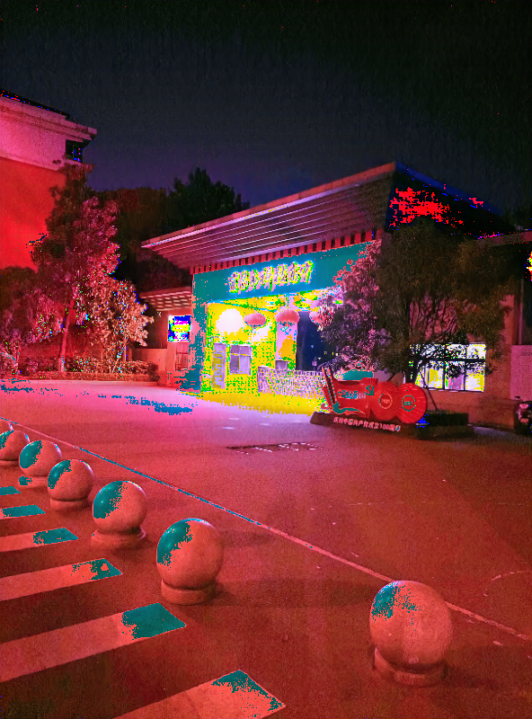

### 百度网盘下载链接
[链接](https://pan.baidu.com/s/1YERon67PRHHKfT5L2Crfxg?pwd=955o)
提取码：955o

将下载的所有pth存放到该weights下
```
.
├─weights
        indoor_G.pth
        list.txt
        LOLv1.pth
        LOLv2_real.pth
        LOLv2_synthetic.pth
        outdoor_G.pth
        README.md
        SID.pth
        SMID.pth
```

### 运行方法：在根目录创建python脚本，复制以下代码即可运行
```angular2html
from model import SNR
import cv2
import os

img = cv2.imread('demo/inputs/img1.png')
im_shape = (img.shape[1]//16*16, img.shape[0]//16*16)
img = cv2.resize(img, im_shape)
model = SNR(6)
out = model(img)
cv2.imwrite('tmp.jpg',out)
```

### 结果对比
 <div class="half" style="text-align: center;">
    
</div>
 <div class="half" style="text-align: center;">
    
</div>
 <div class="half" style="text-align: center;">
    
</div>


